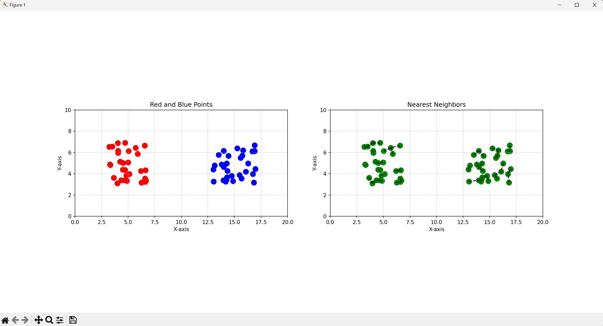
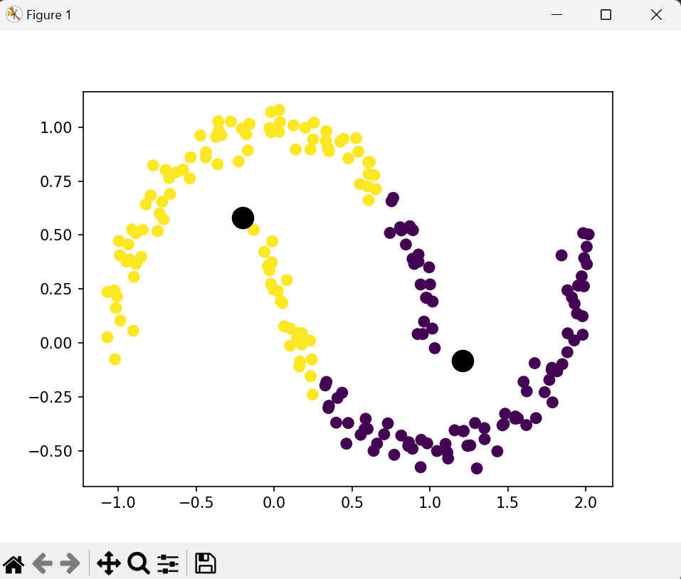
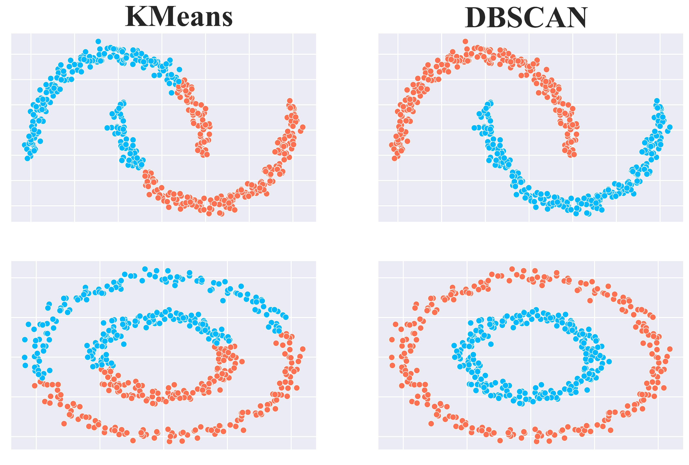
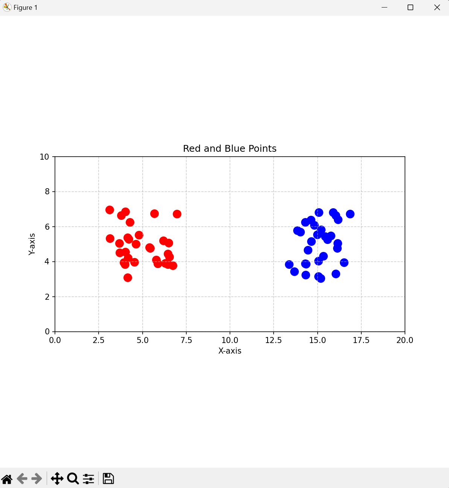
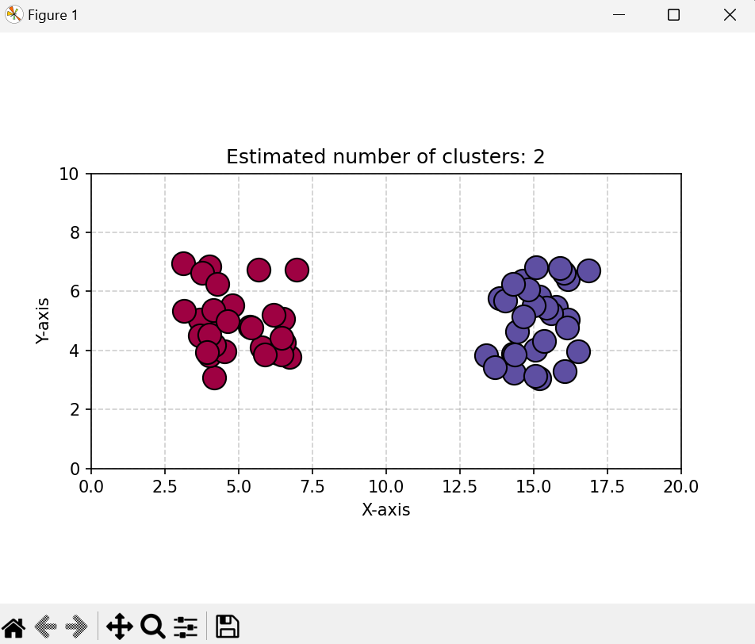

# Rapport de Projet : Machine Learning
Groupe: ER ROUASSE Ayoub, KONE Shyli, MOREL Robin et THIAW Alioune

---

## Sommaire

 1. Introduction  
   1.1 Historique du Machine Learning  
   1.2 Définition et enjeux
   1.3 Présentation du projet  

3. Apprentissage supervisé  
   2.1 Kppv (k plus proches voisins)  
   2.2 MLP (Perceptron multicouche)  
   2.3 Discrimination fonctionnelle  
   2.4 SVM (Machines à vecteurs de support)  

4. Apprentissage non supervisé  
   3.1 Kmeans  
   3.2 DBScan  
   3.3 Carte de Kohonen  

5. Conclusion  

--- 

# 1. Introduction

## 1.1 Historique du Machine Learning

Le Machine Learning (ML) s'est développé à partir des avancées en intelligence artificielle, débutant avec les travaux d'Alan Turing et son test de Turing en 1950. L’apparition des premières méthodes d’apprentissage automatique, comme le Perceptron de Rosenblatt dans les années 1950, a marqué le début d’une approche computationnelle de la modélisation cognitive. L’émergence de l’apprentissage profond et des grandes bases de données au cours des années 2000 a révolutionné le domaine, favorisant son application dans des secteurs variés, notamment la bio-informatique, la finance et la reconnaissance d’images.

## 1.2 Définition et enjeux

Le Machine Learning est une sous-discipline de l'intelligence artificielle visant à développer des modèles capables de généraliser des structures sous-jacentes dans les données, sans instructions explicites. Les défis actuels incluent la complexité algorithmique, la généralisation sur des données hors distribution et la robustesse face aux perturbations adversariales.

## 1.3 Travail demandé

Dans le cadre de ce projet, nous avons developpé plusieurs algorithmes de machine learning, tels que KPPV (KNN), K-means et DBScan. L'ensemble des codes est disponible dans l'archive du projet et sera présenté dans les chapitres correspondants.
Pour chacuns des algorithmes, nous avons utilisé les bibliothèques sklearn et différentes bibliothèques mathématiques telles que numpy et maplotlib.

--- 

# 2. Apprentissage supervisé

L’apprentissage supervisé repose sur l'utilisation d’un ensemble de données étiquetées pour entraîner un modèle, en minimisant une fonction de coût via des méthodes d'optimisation comme la descente de gradient.

## 2.1 Kppv (k plus proches voisins)

Le k-NN est une méthode d’apprentissage non paramétrique basée sur une fonction de similarité, généralement une distance métrique (euclidienne, Manhattan, Minkowski). La classification repose sur le vote majoritaire parmi les k voisins les plus proches, nécessitant une recherche efficace comme les KD-trees ou les ball trees pour améliorer la complexité computationnelle.

Test: 

Pour commencer, nous avons importé les bibliothèques et généré deux types de points (bleus et rouges), chacun étant étiqueté en fonction de sa couleur (1 pour rouge et 0 pour bleu).

```
import matplotlib.pyplot as plt
import numpy as np
import random

nb_point = 30
tab_points = []

for i in range(nb_point):
    x_red = np.random.uniform(3.0, 7.0)
    y_red = np.random.uniform(3.0, 7.0)
    tab_points.append((x_red, y_red, 1))  # 1 pour les points rouges

    x_blu = np.random.uniform(13.0, 17.0)
    y_blu = np.random.uniform(3.0, 7.0)
    tab_points.append((x_blu, y_blu, 0))  # 0 pour les points bleus

```
On les mélange pour casser l'ordre de génération et on récupère leurs coordonnées:

```
random.shuffle(tab_points)
coordinates = np.array([(x, y) for x, y, label in tab_points])
labels = np.array([label for x, y, label in tab_points])

```
coordinates → Contient uniquement les coordonnées (x, y) des points.

labels → Contient les étiquettes (1 pour rouge, 0 pour bleu).

On les sépare pour les afficher de la bonne couleurs:

```
red_x, red_y = coordinates[labels == 1].T
blu_x, blu_y = coordinates[labels == 0].T

```

Création du premier graphique qui affiche seulement les points:
```
ax[0].scatter(red_x, red_y, color='red', label='Red Points', s=100)
ax[0].scatter(blu_x, blu_y, color='blue', label='Blue Points', s=100)
ax[0].set_xlim(0, 20)
ax[0].set_ylim(0, 10)
ax[0].set_aspect('equal', adjustable='box')
ax[0].set_title("Red and Blue Points")
ax[0].set_xlabel("X-axis")
ax[0].set_ylabel("Y-axis")
ax[0].grid(True, linestyle='--', alpha=0.6)

```
Création du deuxième graphique reliant les voisins les plus proche avec k =2:
```
nbrs = NearestNeighbors(n_neighbors=2).fit(coordinates)
distances, indices = nbrs.kneighbors(coordinates)

ax[1].scatter([x[0] for x in coordinates], [x[1] for x in coordinates], color='green', s=100)
for i, (point, neighbors) in enumerate(zip(coordinates, indices)):
    for neighbor in neighbors:
        ax[1].plot([point[0], coordinates[neighbor][0]], [point[1], coordinates[neighbor][1]], 'k--')
ax[1].set_title("Nearest Neighbors")
ax[1].set_xlabel("X-axis")
ax[1].set_ylabel("Y-axis")
ax[1].grid(True, linestyle='--', alpha=0.6)
ax[1].set_xlim(0, 20)
ax[1].set_ylim(0, 10)
ax[1].set_aspect('equal', adjustable='box')

```
Et on affiche tout avec un plt.show, ce qui nous donne les deux graphiques suivants :



## 2.2 MLP (Perceptron multicouche)

Le MLP est un réseau de neurones feed-forward composé de plusieurs couches de neurones interconnectés. L’apprentissage repose sur l’optimisation des poids par rétropropagation de l’erreur et une descente de gradient stochastique. L’utilisation de fonctions d’activation non linéaires (ReLU, tanh, sigmoïde) permet d’accroître la capacité du réseau à modéliser des relations complexes.

## 2.3 Discrimination fonctionnelle

La discrimination fonctionnelle repose sur l’optimisation d’une fonction de séparation linéaire ou quadratique, exploitant la maximisation du critère de Fisher. Elle est couramment employée pour la classification de données gaussiennes multi-variées, avec une analyse des vecteurs propres pour maximiser la séparabilité inter-classes.

## 2.4 SVM (Machines à vecteurs de support)

Les SVM optimisent une frontière de décision en maximisant la marge entre les classes, en utilisant des noyaux (linéaires, RBF, polynomiaux) pour projeter les données dans des espaces de dimension supérieure. La résolution repose sur des méthodes d'optimisation convexe comme les multiplicateurs de Lagrange et la programmation quadratique.

--- 

# 3. Apprentissage non supervisé

L’apprentissage non supervisé repose sur l’analyse exploratoire des structures sous-jacentes dans des données non étiquetées.

## 3.1 Kmeans

L’algorithme Kmeans partitionne les données en k clusters en minimisant la variance intra-cluster par rapport aux centroïdes. Il est sensible aux conditions initiales.

Test:
Pour K-means, nous avons deux exemples : l’un avec des points répartis en deux groupes, et l’autre avec deux demi-lunes. Dans ce rapport, nous ne présenterons que le second cas, tandis que le résultat du premier est disponible dans l'archive.

Importations des bibliothèques:
```
import matplotlib.pyplot as plt
import numpy as np
from sklearn.datasets import make_moons
from sklearn.cluster import KMeans

```
On génère des 200 points sous formes de lunes avec un léger bruit:
```
X, y = make_moons(200, noise=.05, random_state=0)
```
On y ajoute k-means avec 2 clusters, on entraine le modèle sur les données x et on attribue les points pour chaques clusters trouvé par l'algorithme:
```
kmeans = KMeans(n_clusters=2)
kmeans.fit(X)
y_kmeans = kmeans.predict(X)

```
On affiche les résultats avec l'affichage du centre pour mettre en avant le défaut de k-means sur ce type de données:

```
plt.scatter(X[:, 0], X[:, 1], c=y_kmeans, s=50, cmap='viridis')
centers = kmeans.cluster_centers_
plt.scatter(centers[:, 0], centers[:, 1], c='black', s=200);

```
On affiche avec plt.show ce qui nous donne le résultat suivant:

Comme on peut le voir les données ne sont pas séparées selon leurs appartenance à une lune mais par le centre calculé par K-means, pour avoir le résultat voulu, il faudrait un autre algorithme tel que DBScan.


## 3.2 DBScan

DBScan segmente les données en fonction de leur densité locale, permettant la détection de clusters de formes arbitraires et l’identification de points aberrants. Il repose sur la définition d’un rayon de voisinage (ε) et d’un seuil minimal de points requis pour former un cluster.

Test:

Déclaration des bibliothèques:
```
import matplotlib.pyplot as plt
import numpy as np
import random
from sklearn.cluster import DBSCAN

```
On génère les points :
```
nb_point = 30
tab_points = []
for i in range(nb_point):
    x_red = np.random.uniform(3.0, 7.0)
    y_red = np.random.uniform(3.0, 7.0)
    tab_points.append((x_red, y_red, 1))  # 1 for red

    x_blu = np.random.uniform(13.0, 17.0)
    y_blu = np.random.uniform(3.0, 7.0)
    tab_points.append((x_blu, y_blu, 0))  # 0 for blue

```
On mélange les points et on sépare les coordonnées des étiquettes:
```
random.shuffle(tab_points)
coordinates = np.array([(x, y) for x, y, label in tab_points])
labels = np.array([label for x, y, label in tab_points])

```
On affiche les points:
```
plt.figure(figsize=(8, 8))

# Plot the red points
plt.scatter(red_x, red_y, color='red', label='Red Points', s=100)

# Plot the blue points
plt.scatter(blu_x, blu_y, color='blue', label='Blue Points', s=100)

# Set fixed axis limits
plt.xlim(0, 20)
plt.ylim(0, 10)
plt.gca().set_aspect('equal', adjustable='box')

# Add labels and title
plt.title("Red and Blue Points")
plt.xlabel("X-axis")
plt.ylabel("Y-axis")

# Display the grid
plt.grid(True, linestyle='--', alpha=0.6)

# Show the plot
plt.show()

```
Ce qui nous donne le résultat suivant avant application de DBScan:


On applique donc l'algorithme DBScan avec epsilon =2 :
```
debscan = DBSCAN(eps=2, min_samples=2).fit(coordinates)
labels_pred = debscan.labels_
n_clusters_ = len(set(labels_pred)) - (1 if -1 in labels_pred else 0)

```
Affichage du résultat de DBScan:
```
unique_labels = set(labels_pred)
core_samples_mask = np.zeros_like(labels_pred, dtype=bool)
core_samples_mask[debscan.core_sample_indices_] = True

colors = [plt.cm.Spectral(each) for each in np.linspace(0, 1, len(unique_labels))]
for k, col in zip(unique_labels, colors):
    if k == -1:
        # Black used for noise.
        col = [0, 0, 0, 1]

    class_member_mask = labels_pred == k

    xy = coordinates[class_member_mask & core_samples_mask]
    plt.plot(
        xy[:, 0],
        xy[:, 1],
        "o",
        markerfacecolor=tuple(col),
        markeredgecolor="k",
        markersize=14,
    )

    xy = coordinates[class_member_mask & ~core_samples_mask]
    plt.plot(
        xy[:, 0],
        xy[:, 1],
        "o",
        markerfacecolor=tuple(col),
        markeredgecolor="k",
        markersize=6,
    )
plt.title(f"Estimated number of clusters: {n_clusters_}")
# Set fixed axis limits
plt.xlim(0, 20)
plt.ylim(0, 10)
plt.gca().set_aspect('equal', adjustable='box')

# Add labels
plt.xlabel("X-axis")
plt.ylabel("Y-axis")

# Display the grid
plt.grid(True, linestyle='--', alpha=0.6)

# Show the plot
plt.show()

```
Ce qui nous donne le résultat suivant:


## 3.3 Carte de Kohonen

Les cartes de Kohonen sont des réseaux de neurones non supervisés appliqués à la réduction dimensionnelle et au clustering. L’auto-organisation repose sur une mise à jour compétitive des poids des neurones à travers une fonction de voisinage gaussienne qui décroît au fil des itérations.

---

# 4. Conclusion

Ce projet nous a permis d'explorer plusieurs algorithmes de Machine Learning dans les domaines de l'apprentissage supervisé et non supervisé. Nous avons étudié des méthodes classiques comme le kppv, le Perceptron multicouche (MLP), la discrimination fonctionnelle, et les machines à vecteurs de support (SVM), en analysant leur fonctionnement théorique et leurs applications pratiques à travers des implémentations spécifiques. En parallèle, nous avons exploré des algorithmes non supervisés tels que K-means, DBScan et les cartes de Kohonen, illustrant leur capacité à segmenter et à organiser des données non étiquetées selon diverses approches.

Les tests réalisés montrent l'efficacité et les limites de chaque algorithme en fonction des types de données traitées. Par exemple, bien que K-means soit performant dans des contextes où les données sont bien séparées en clusters, DBScan a démontré une meilleure aptitude à gérer des formes de clusters plus complexes, telles que celles rencontrées dans des jeux de données avec des structures non convexes.

Ce projet nous a permis de mieux comprendre la diversité des techniques d'apprentissage automatique et leur applicabilité dans différents scénarios. Les outils et méthodes présentés constituent une base solide pour aborder des problématiques de Machine Learning plus complexes.